# chatgpt-dev-mcp Architecture

## Purpose

`chatgpt-dev-mcp` is a local policy wrapper for safe multi-project
development. It exposes an exact 52-tool Stable Gateway MCP surface plus a
separately versioned Capability Registry for long-tail operations, while
keeping project selection, discovery, write permission, task execution, and
development session creation behind local policy gates.

```mermaid
flowchart LR
  C["Normal ChatGPT / Private App"] --> T["Secure MCP Tunnel"]
  T --> L["LaunchAgent tunnel-client"]
  L --> S["local STDIO chatgpt-dev-mcp"]
  S --> R["local config registry"]
  R --> D["PROJECT_DISCOVERY candidate"]
  D --> RO["READ_ONLY workspace"]
  RO --> PROMOTE["explicit intent + allowlisted promotion"]
  PROMOTE --> REG["atomic registry entry"]
  REG --> W
  RO --> A["explicit local approval"]
  A --> W["managed detached worktree"]
  W --> LEASE["Director path/resource lease"]
  LEASE --> DEV["DEVELOPMENT: patch / task / diff"]
  DEV --> VERIFY["diff-pinned verification + security receipts"]
  VERIFY --> PREFLIGHT["canonical integration preflight"]
  PREFLIGHT --> INTEGRATE["explicit approved integration; no commit/push"]
  DEV --> RESUME["reconnect: same-owner safe-local resume when enabled"]
  RESUME --> DEV
  DEV --> REATTACH["fallback: explicit session attach"]
  REATTACH --> DEV
```



## Runtime layers

1. **MCP transport:** JSON MCP STDIO behind a long-lived broker. Each logical
   connection owns one fresh `WrapperRuntime`, `InitializeReplayState`, and
   request registry, moving through `NEW` → `INITIALIZING` → `READY` and
   closing through `CLOSING` → `CLOSED`. The measured pre-operation duplicate
   initialize is replayed once. After normal operation, the next initialize
   retires the old runtime and starts a new one; request-id epochs, `id=0`,
   params equality, and `server/discover` are not boundary heuristics. Explicit
   markers are honored and stale marker traffic is rejected. A live
   side-effecting request blocks replacement as `outcome_unknown`; no protocol
   or policy state is copied. Logical runtime retirement preserves the
   persistent Director/session/lease records; final broker shutdown retains the
   existing stale/reconciliation cleanup. Persistent state is resumed only
   through an explicit handle. `initialize` advertises `tools.listChanged=true`;
   this server does not emit unsolicited `notifications/tools/list_changed`.
2. **Wrapper policy:** `WrapperRuntime` owns the visible tool registry,
   registry IDs, profiles, candidate IDs, approval/session state, output
   sanitization, schema metadata, and health reporting.
3. **Upstream safe runtime:** `coding-tools-mcp` provides workspace containment,
   symlink checks, atomic patching, read-only Git, bounded task process
   handling, and safe command policy. The wrapper never enables dangerous mode.
4. **Local registry:** `~/.config/local-dev-mcp/config.json` remains
   operator-owned. Model-reachable registry changes use dedicated
   allowlisted APIs only: `workspace_register_preflight` pins an existing Git
   repository and `workspace_register` consumes an exact explicit confirmation;
   unregister and limited registration-update pairs use the same digest/source
   pinning. The APIs cannot edit roots, credentials, unrelated workspaces, or
   arbitrary JSON.
5. **Director persistence:** v0.41 stores bounded task/dependency/session,
   lease, baseline-snapshot, idempotent-start, verification, security,
   integration, Git closeout audit, generation-import provenance, and v26
   READ_ONLY handle state in the private
   `~/.cache/local-dev-mcp/director.sqlite3` database (or its internal data-dir
   override). Internal SQLite schema 14 uses migrations, WAL/foreign-key
   checks, transactional writes, retention, and corruption fail-closed
   handling. Additive request/provisioning/import/READ_ONLY tables retain
   bounded non-secret lifecycle metadata only. Request lifecycle events pin
   the schema revision/hash, transport generation, physical child, and
   logical connection at acceptance. Provisioning events are append-only
   lifecycle evidence for project/session provisioning, registration, baseline
   preparation, relocation preflight/apply, runtime candidate/maintenance
   operations, retained-session control operations, and evidence import; they
   never store raw arguments, patches, command output, credentials, or approval
   tokens.
   Restart reconciliation
   validates current workspace/worktree identity, source commit, expiry, and
   hashes; it never restores in-flight work as running or retries a side
   effect.
   The Registry-only `development.session.reconcile_stale_state` capability
   adds an append-only reconciliation receipt over this same authority domain.
   Its preflight pins a digest of the session row, sidecar, Git/worktree
   identity, task/lease/process state, and existing evidence; execute rereads
   that digest before changing lifecycle metadata. Dirty worktrees are archived
   for provenance and retained, while missing worktrees require an explicit
   allowlisted legacy root plus verifiable Git absence. No worktree removal or
   unconditional prune is part of reconciliation.
   The Registry-only `runtime.candidate.activate` capability adds a separate
   human-approved candidate boundary: clean Git HEAD, schema-14 database,
   76-tool catalog, doctor/canary receipt, a deterministic semantic database
   digest plus physical database identity, and schema-compatible rollback
   authority are all required before an official maintenance host may repin a
   runtime. The semantic digest includes schema definitions and all logical
   application rows; only `request_lifecycle_events` rows are excluded because
   the request audit changes during the gateway lifecycle. The installed v26
   wrapper binds that host only from the operator-controlled v26 environment;
   ordinary wrappers remain without a process executor. `development.evidence.import_generation`
   imports only one selected session and its dependency closure through the
   persistence API; source-generation databases and sidecars remain read-only
   and are never copied or replaced.

## Logical project and parallel sessions

The registry contains one operator-owned logical project. Physical development
sessions are separate immutable-baseline snapshots underneath that project:

```text
project_id / logical_workspace_id
├── task A ↔ chat/owner ↔ session A ↔ worktree A ↔ lease/evidence
├── task B ↔ chat/owner ↔ session B ↔ worktree B ↔ lease/evidence
└── task C ↔ chat/owner ↔ session C ↔ worktree C ↔ lease/evidence
```

When `isolated_development.auto_create_sessions=true` is explicitly present in
the local project policy, `director_development_start` performs task
registration, exact commit-object baseline selection, dirty-state evidence,
project-wide path/resource conflict analysis, managed detached worktree
creation, session persistence, and lease assignment as one bounded provisioning
operation. Empty scopes are rejected; workspace-wide scope requires explicit
policy permission and a bounded reason. Canonical uncommitted content is never
copied implicitly. An explicit `director_baseline_snapshot` captures a
secret-safe immutable tracked patch plus approved ordinary untracked files, and
`source_snapshot_id` can apply that exact snapshot to multiple sessions. A
project can have up to the configured safe parallelism (capped by the server);
disjoint paths and resources proceed concurrently, while overlap is blocked or
represented as a dependency.

`director_status_summary` is the control-plane view for a project. It reports
baseline/current canonical HEAD and dirty evidence, active sessions/writers,
task/dependency state, lease expiry, verification/security evidence,
integration queue order, stale/replan candidates, and cleanup candidates.

Canonical integration remains a separate queue boundary: review-ready tasks
are preflighted against the current canonical checkout, conflict and
diff/evidence hashes are rechecked, then the configured approval policy is
applied. Commit and push remain separate delivery boundaries. A canonical
advance or conflicting dirty change can make the queue item stale/conflicted;
no reset, overwrite, rebase, or destructive retry is implicit.

## Explicit project provisioning

Existing-repository registration is deliberately separate from project
creation:

```text
workspace_register_preflight
  -> explicit confirmation
  -> workspace_register
  -> optional isolated DEVELOPMENT session
```

The preflight canonicalizes and root-checks the path, requires a real Git
repository, rejects sensitive stores and duplicate/overlapping registrations,
captures branch/HEAD/dirty evidence, pins the registry digest, and prepares an
empty command profile unless commands were explicitly supplied. The mutation
adds only that one workspace entry atomically and read-backs the result. The
corresponding unregister pair removes only the entry after blockers are absent;
the repository is never deleted.

The normal explicit development path is:

```text
workspace_discover
  -> candidate (READ_ONLY)
  -> explicit intent claim
  -> workspace_promote_development
  -> director_development_start
  -> managed worktree + path-scoped lease
```

`workspace_project_create` is the new-project variant. It permits only a
single safe child directory below a configured discovery root, performs no
implicit package/network operation, and can initialize local Git. Registry
changes are limited to one new workspace entry and remain policy-checked.

The explicit intent claim is necessary but not sufficient: READ_ONLY and
discovery-only calls, root escapes, symlink escapes, sensitive paths, ownership
or permission failures, repository identity changes, duplicate/overlapping
workspace paths, and unsafe config state all fail closed. Dirty canonical files
are preserved as evidence; no reset, checkout, stash, overwrite, staging,
commit, remote creation, push, or canonical integration is implicit.

### Explicit routing and selection

`workspace_open` changes only the connection's selected convenience view. It
does not own session lifecycle. Bound reads, diffs, tasks, verification,
browser/desktop adapters, and writes resolve explicit workspace/session/worktree
identity. Mutations additionally revalidate writer authority immediately before
execution. Explicit handles take precedence over selected convenience state.

## Transport and release state

The production route remains ChatGPT Private App → Secure MCP Tunnel →
LaunchAgent → local STDIO. The wrapper-owned Streamable HTTP transport is a
loopback-oriented alternative for lifecycle experiments and controlled local
operation; production selection is an operator configuration decision.

The public tool schema uses two complementary identity signals: an explicit
registry revision and a deterministic definition hash. The stable direct
surface is intentionally bounded, while long-tail operations live in the
Capability Registry.

Host filesystem mutation is a dedicated bounded capability rather than an
extension of arbitrary command execution. Preflight pins the exact target and
operation, and apply revalidates before mutation. Sensitive roots, symlink
drift, shell text, caller-selected executables, and arbitrary permanent delete
paths fail closed.

## Git closeout boundary

Git delivery is a separate state machine from ordinary editing:

```text
task-owned change + fresh evidence
  -> stage selection
  -> commit preflight
  -> commit
  -> push preflight
  -> normal non-force push
```

The commit and push steps cannot silently perform one another. Arbitrary shell,
reset, amend, force push, force-with-lease, remote URL changes, custom remote
helpers, and credential operations are not implicit side effects of ordinary
development work.

## Workspace state model

```text
PROJECT_DISCOVERY
  -> ephemeral candidate ID
  -> READ_ONLY open
  -> explicit development intent/policy
  -> optional isolated DEVELOPMENT session
  -> read / patch / registered task / diff
  -> verification / review / delivery
```

The default discovery root is only `~/Developer`. General-file roots are
normally explicit opt-in `READ_ONLY` roots. `readonly_path` is a narrow
ordinary-directory read boundary. The frozen v25 surface keeps its historical
process-local handle behavior; the v26 canary uses the existing bounded,
TTL-checked Director registry so the handle identity can be resolved across
MCP children. Neither surface can turn the handle into workspace, Git,
execution, DEVELOPMENT, or writer authority.

## Director parallel-development control plane

The logical project, concrete working tree, and development-session lease are
separate identities. Writer ownership is coordinated by logical project plus
the concrete worktree, with path/resource overlap checks across the project.

`director_writer_lease` accepts an owner/task and normalized path/resource
scopes. Each lease pins base revision and scoped file hashes. Patch preflight
and application require covering authority and reject stale bases. Successful
owned writes invalidate stale evidence.

`orchestration_plan` computes dependencies and overlapping writers. Disjoint
ready writers can proceed concurrently; overlapping writers require ordering or
separation.

Verification and security receipts are diff/revision pinned. Later writes or
independent drift invalidate stale evidence. Integration applies only the
preflight-pinned managed change; it does not implicitly commit or push.

## Development isolation and direct editing

Direct `DEVELOPMENT` editing uses the registered canonical repository with
workspace containment, symlink, sensitive-path, atomic-patch, and safe-task
controls. The canonical repository may become dirty and normal Git status/diff
can see those changes.

When an isolated session is used, the server pins an exact source revision,
creates a managed worktree below the managed cache root, and validates target
identity/containment before activating it. Canonical uncommitted content is not
implicitly copied unless an explicit baseline snapshot is supplied. Session
recovery is identity-checked; stale or mismatched sessions fail closed.

Only registered project task classes such as test/lint/build/dev/format are
available through the bounded task surface. Arbitrary shell execution remains
outside the normal public path.

## Observability

`server_info` reports the visible tool schema identity, runtime/registry health,
and workspace/profile details when selected. Client-side cached schemas must be
compared against the server-advertised schema and rescanned when stale.

For operational procedures see [`OPERATIONS_GUIDE.md`](OPERATIONS_GUIDE.md).
For trust boundaries and safety invariants see
[`SECURITY_MODEL.md`](SECURITY_MODEL.md).
